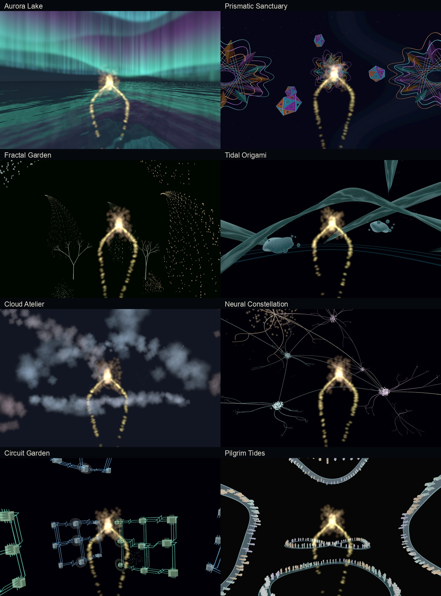
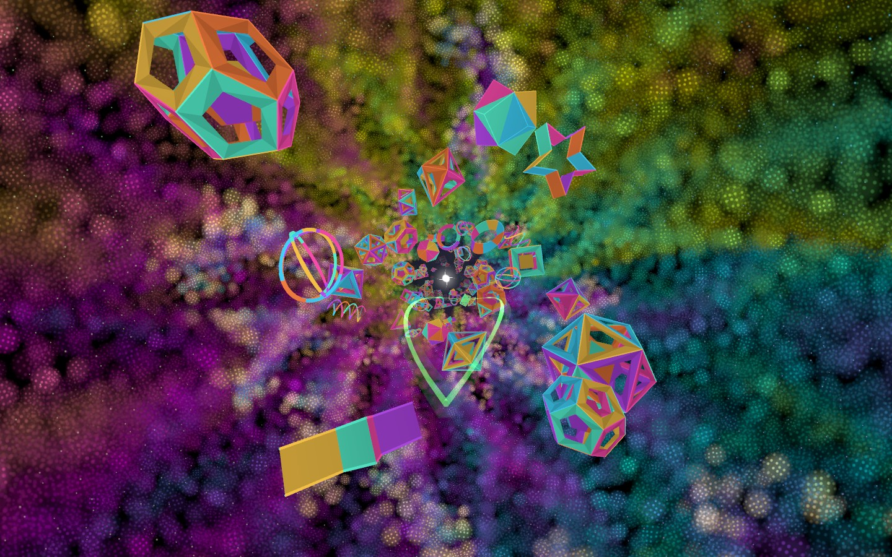
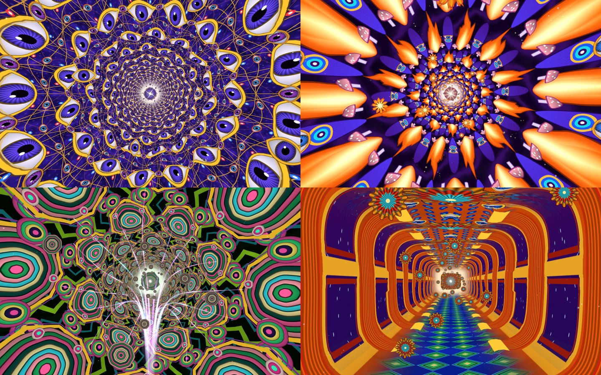

# Breathwork VR

Nine native Godot meditation worlds for Meta Quest, each eight minutes long. Choose a world from a spatial startup menu, then follow a gently drifting visual breath cue through breath-responsive geometry, fractals, water, clouds, neurons, circuits, quiet crowds, or a painted visionary tunnel.

The approved **Aurora Lake** remains available with its layered auroras, dynamic water, golden particle orb, and positional sound. All worlds share tracked particle hands, reclining support, and one neck-centered breath reference. Inhale destinations and exhale origins use this reference; Prismatic’s lower inhale is an explicit offset from it. Prismatic Sanctuary uses a slow geometric tunnel enclosed by dense, layered fractal particle clouds, pulsing green plasma inhale paths, sixteen rainbow outflow beams, and a permanently visible white destination core. Experiences 3–8 each have their own wordless focal sculpture and directed breath flows: a fractal iris, water lotus, cloud vortex, neural crown, capacitor plates, and a gathering of particle figures. Experience 9, **Visionary Temple**, is a second gaze-following tunnel whose sculpted, painted walls pass through eight one-minute passages: an eye lattice, Indra's net, a flame mandala, a peacock vault, kaleidoscope rings, a lotus garden, a crystal geode and a temple hall. Each passage's walls are displaced along the contours of its painting, and each dissolves into the next through layered, counter-turning shells. Tumbling 3D relics (jewels, lattices, feathers, lotuses, crystals and bells) drift along varied paths through it. It has golden plasma inhale arcs, violet petal outflow and a 60 BPM transcendental score clocked to its 4/4/6/2 breath. Every world has its own rhythm and cohesive soundtrack.

See [the experience catalog and review notes](docs/EXPERIENCES.md) for all nine directions, rhythms, and the critique/refinement process. The [verification record](docs/VERIFICATION.md) distinguishes desktop checks from headset validation.



Experience 2 now has a 60 BPM transcendental electronic score and a gaze-following particle tunnel:



Visionary Temple paths through four painted passages over eight minutes: an eye lattice, a flame mandala, kaleidoscope rings and a temple hall:



## Choose an experience

In Quest, look at a card for 2.5 seconds; its highlight and percentage show selection progress. The menu anchors to the current gaze, including while lying down. Looking well away for a few seconds brings the menu back in front of you. On desktop, click a card or press **1–9**. Press **R** to re-anchor the desktop menu.

Sessions fade back to the selector when complete. To pause or end early, raise a hand in front of your face with your **palm toward you**, then sweep it sideways in either direction. A confirmation appears with a visible gaze pointer. Hold the pointer over **End session** or **Continue** for 1.8 seconds. Lower your hand before waving again. This works while reclining. Quest 2/3 use head-directed gaze; their hardware does not track the eyes. On desktop, press **M**, then gaze or click a choice. Holding a controller button or Escape/Space for 1.5 seconds also returns early. Follow the breathing comfortably; holds can be gentle pauses.

## Run

Use **Godot 4.6.3** with the Mobile renderer. Open `project.godot` in the editor, or run:

```sh
GODOT_BIN=/path/to/Godot tools/run.sh
```

The local development environment uses `.tools/Godot.app/Contents/MacOS/Godot` by default. Hold Escape or Space for 1.5 seconds to fade out of a desktop preview.

## Build for Quest

The repository includes Godot OpenXR Vendors 5.1.0 and its license notices. Install the matching Godot Android export template through the editor, then configure JDK 17, Android SDK platform 36, build-tools 36.1.0, and NDK 29.0.14206865. The Gradle build directory is `android`; the generated project under `android/build` is local and ignored.

Configure a local debug keystore at `.tools/debug.keystore`, or update the export preset to your own signing configuration. Private keystores, SDKs, APKs, and credentials are not included.

```sh
GODOT_BIN=/path/to/Godot tools/export_quest.sh
QUEST_SERIAL=your_physical_quest_serial tools/deploy_quest.sh
```

The headset needs developer mode and USB debugging authorization. The installer refuses emulator serials. Optical hands and controllers are supported; optical pinch gestures do not trigger the controller hold-to-exit shortcut.

## Verify and develop

Install the packages in `audio/requirements.txt`, FFmpeg/ffprobe, and `oggenc` (Vorbis tools). Set `PYTHON_BIN` and `GODOT_BIN` as needed, then run `tools/verify.sh`. It checks all nine rhythms and scores, the visionary passage schedule, silent holds, selector anchoring, session timing, XR joint transforms, tracking loss, final audio transport, generated assets, and GPU address math. Godot can return success after a shader or script error; the verifier also examines its error output.

`scripts/build_scene.gd` regenerates the authored scene. Visual review commands can use `--review-path`, `--review-start`, `--review-duration`, and `--review-recline` after Godot's `--` argument separator. Desktop fixed-timestep review is not a headset frame-rate measurement.

## Audio and provenance

Runtime audio is included under `assets/audio`. Every score is one coherent 480-second delivery on a strict 60 BPM grid, so its beats land on the whole-second breath ticks, through every movement change and dissolve. Prismatic Sanctuary, Visionary Temple and the four themed scores use authored electronic synthesis, with every note, echo and pulse placed on the beat grid. Aurora Lake, Tidal Origami and Pilgrim Tides are each three Lyria 3.5 movements that play their own soft pulse on every beat at 60 BPM: a felt mallet, felt-piano droplets and a felt-piano walking pulse. Lyria 3.5 keeps a tempo written into its prompt, so each take is measured with librosa, corrected by its tiny period error and placed so its beats land on the ticks. Movements join on bar lines, with the gain ridden through each join so it neither sags nor lurches. No pulse is synthesized. Lyria RealTime, used for these scores in version 2.8, ignored its BPM setting (about 72 BPM when asked for 60). The spatial water and mote textures still use earlier Lyria material. `python -m audio.beat_grid` verifies every delivery with librosa: 60 BPM tempo, onsets folding at exactly 1.000 s, beats peaking with the breath tick sample measured the same way, tracked beats within 50 ms of the ticks, and alignment held in every window and transition. Authored prompts, generation code, and non-secret provenance are under `audio`. Regeneration requires `GEMINI_API_KEY` or `GOOGLE_API_KEY` in the environment. Untouched generation masters and large verification captures remain local and are excluded from Git and Android exports.

The most recent refinement keeps the approved outbreath samples unchanged while softening the inhale. See the audio contract tests for the preserved sample hashes.

The breath cue's count ticks are one looping track per breath pattern, with every tick on the first sample of its second. The director starts, pauses and resumes the score, the breath guide and the ticks inside `AudioServer.lock()`, so all three share one sample clock and each count, breath phase change and beat sounds together. `python tools/check_cue_alignment.py` records each world's score, breath guide and ticks from Godot's own mixer (headless, about half a minute per world, through a pause) and confirms every tick sounds with a whole second of the score and the matching moment of the breath guide.


Regenerate the four themed synthesized scores with `python -m audio.generate_theme_scores`, Prismatic Sanctuary with `python -m audio.generate_prismatic_trance`, the Visionary Temple journey with `python -m audio.generate_visionary_journey`, and the Lyria scores with `python -m audio.generate_lyria60 generate` followed by `python -m audio.generate_lyria60 master`. Generation requests two takes of each movement, because Lyria 3.5 returns at most about three minutes. Mastering rejects takes whose beat wanders, chooses the takes and joins, and verifies every delivery before replacing it. Beat analysis uses librosa from `audio/requirements.txt`. Bake the Mandelbrot fields with `python tools/generate_fractal_fields.py` and the procedural visionary ornament tiles and sigils with `python tools/bake_visionary_tiles.py`.

The four AI-painted Visionary Temple passages, their sigils and all eight relief maps come from `python -m art.visionary_passages` (`candidates`, `seam`, `place`, `relief`, `bake` and `sprites`). It uses gpt-image-2 (`OPENAI_API_KEY`) for paintings and sprites, and Nano Banana Pro (`GEMINI_API_KEY` or `GOOGLE_API_KEY`) for pixel-aligned height maps and most seam repairs. `python -m art.visionary_relics` generates the relics' material-capture spheres with Nano Banana Pro and composes their atlas. `art/visionary_passages_provenance.json` and `art/visionary_relics_provenance.json` record every prompt, model, seam measurement and output hash. Untouched API masters stay local in `art/masters/`, which Git ignores and Godot skips.

Generate the breath guides with `python -m audio.synth_suite_breath`. The earlier stitched Lyria movement pipeline (`python -m audio.generate_suite`) is retained for reference only; it is not tempo-aligned and should not be run over the current deliveries. `python -m audio.review_suite` performs an explicitly automated audio audit; it is separate from runtime playback and requires API access. The Quest application itself needs no internet connection.

## Reusable development skill

[breath-visualization-patterns](skills/breath-visualization-patterns/SKILL.md) makes the universal neck breath center a **MUST** for every inhale destination and exhale origin, including experience-specific offsets. The canonical headset-space offset is `BreathGeometry.BREATH_CENTER_OFFSET` in `scripts/breath_geometry.gd` (18 cm below the headset). The skill is also installed in the local Codex skills directory.

[godot-quest-breathwork](skills/godot-quest-breathwork/SKILL.md) documents the session's lessons: calm particle timing, mouth-relative presence, reclined composition, hand tracking, mobile rendering, audio mastering, and honest visual/device verification. Copy its folder into your Codex skills directory to reuse it. The companion [session lessons](skills/godot-quest-breathwork/references/session-lessons.md) include a practical review rubric.

## One-minute video previews

`python tools/render_previews.py --output /path/to/previews` records all nine worlds with their runtime soundtrack and breath cues. Each MP4 is 60 seconds, 1440×900 at 30 FPS with stereo AAC audio; the view slowly tilts upward to show the reclining composition. The output includes a local `index.html` gallery and a validation manifest. Movie sources and delivered previews are local artifacts rather than Android resources. These are desktop previews, not stereo headset recordings.
