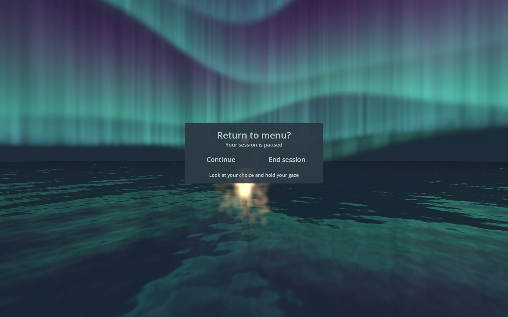

# Version 2.5 — cloud tunnel and video previews

Prismatic Sanctuary now encloses the viewer in 98,304 procedural cloud grains and 32,768 detached filaments. Three radial strata retain dense coverage while adding real thickness, curved drift, raised geometric ornament, and small satellite flecks. The previous tiled surface has been removed. The approved breath streams, persistent white destination, gaze lag, fog level and single trance score are retained.

Eight one-minute desktop preview videos are generated with actual runtime music and breathing audio. Each smoothly looks from seated level toward an 80-degree upward view, with no instructional overlays.

## Previous release records

# Version 2.4 — wordless themed worlds

Experiences 3–8 now have different visual breath languages, full surrounding particle ecologies, and stronger overhead compositions. All are eight minutes, with their existing individual rhythms. Words remain only in the selector and deliberate exit confirmation.

| World | Visual breath language | Surrounding scene |
|---|---|---|
| Fractal Garden | A six-fold particle iris opens on inhale and closes on exhale. | A sculpted kaleidoscope of evolving Mandelbrot fields |
| Tidal Origami | A particle lotus lifts and opens liquid petals during inhale, then drains inward on release. | Suspended liquid loops and breathing water petals |
| Cloud Atelier | A soft particle vortex expands and contracts with the breath. | Layered cloud islands with a breathing vortex |
| Neural Constellation | A twelve-arm dendritic particle crown gathers and radiates breath signals. | A deeper living network of converging signals |
| Circuit Garden | Seven nested particle capacitor plates charge and expand during inhale, releasing amber current on exhale. | Nested circuit assemblies with flowing charge |
| Pilgrim Tides | A ring of twenty-four tiny particle figures gathers and raises its arms on inhale, then opens on release. | Braided processions and a gathering of lantern figures |

Four mismatched scores have been replaced: recursive glass harmonics for Fractal Garden, airy harmonic swells for Cloud Atelier, responsive cellular tones for Neural Constellation, and warm oscillator sequences for Circuit Garden. The aquatic and humanist chamber scores remain. Each is one mastered arrangement, not an extra overlay.

Prismatic Sanctuary adds sixteen curved rainbow outflow beams and directional traveling pulses on both flows. Fog is lighter and instruction labels are removed. The bright white destination core persists through every phase; its surrounding rays grow during the full hold and vanish during exhale over 500 ms.

The review found and corrected a transparent-vault ordering bug that hid near fractal particles, excessive fine fractal contrast, and oversized near-face particles. All six reclining compositions now show their focal cue and multiple surrounding depth layers. Desktop evidence cannot establish subjective stereo comfort.

## Previous release history

# Eight worlds, one gentle breath

Each world supports reclining, lasts exactly eight minutes, and renders tracked particle hands. Prismatic Sanctuary uses slow forward optic flow toward a distant star; Aurora Lake retains its golden orb, while experiences 3–8 now have distinct wordless particle sculptures and delayed gaze following. Breathing sounds—not a separate visual metronome—provide the phase clock. The original Aurora Lake retains its approved outgoing particles and outbreath recording.

The new worlds were authored in seven separate implementation subsessions. Each owns a small procedural scene layer and consumes the same breath state. All were rendered in contrasting phases and reclining views before integration; review findings drove a second pass where necessary.

| Experience | Creative direction | Seconds: in / full pause / out / empty pause | Cycles | Music direction |
|---|---|---:|---:|---|
| Aurora Lake | Close layered auroras above irregular breathing waves; a giving and recovering golden particle orb | 4 / 2 / 8 / 0 | 34 + 4s settling | Warm evolving ambient, positional water and particle voices |
| Prismatic Sanctuary | A gaze-following geometric tunnel: sixteen shape families, green plasma inhale, sixteen rainbow outflow beams and a bright white center | 4 / 4 / 4 / 4 | 30 | 90 BPM electronic trance: warm synth textures, rounded kick, bass and arpeggios |
| Fractal Garden | Actual Barnsley fern and tetrahedral IFS structures; seedpods gather, branch and dissolve | 6 / 0 / 6 / 0 | 40 | Organic woodland electroacoustic textures |
| Tidal Origami | Water folds into impossible suspended arches and smaller floating liquid forms | 6 / 2 / 8 / 0 | 30 | Rounded resonant bowls, fluid glass and soft waterlike tones |
| Cloud Atelier | Clouds sculpt a breathing vault; irregular stratus islands and nearby whorls part and gather | 5 / 0 / 5 / 0 | 48 | Airborne neoclassical ambient and soft suspended strings |
| Neural Constellation | Organic dendrites connect particle somas; gentle signals propagate with the breath | 5 / 0 / 7 / 0 | 40 | Intimate bioelectronic harmonics and answering echoes |
| Circuit Garden | Floating circuit lattices store charge and release a slow, soft current | 4 / 0 / 6 / 0 | 48 | Warm analog synths and sparse electric-piano-like tones |
| Pilgrim Tides | Hundreds of simple humanoids walk floating promenades, gather, and bring their hands inward on inhalation | 6 / 2 / 6 / 2 | 30 | Patient humanist chamber minimalism |

These are gentle pacing invitations. The startup menu explicitly invites comfortable breathing and treating holds as gentle pauses. Nothing requires the user to perform a forced breath or keep pace to continue.

## Pause or return at any time

Raise a palm toward your face and sweep it sideways in either direction to pause and open the confirmation. No persistent control is displayed during the session. A visible gaze pointer and progress ring let you choose End session or Continue with a 1.8-second dwell. Lower your hand before the next wave. The gesture and confirmation follow the head orientation, including while reclining; Quest 2/3 use head-directed gaze because those headsets have no eye tracker. Tracking jumps, back-facing palms, distant hands, stationary poses and controller-synthesized hands are rejected. Desktop supports M and mouse selection; the controller hold shortcut remains available.

## Review criteria carried forward

- Incoming particles must gather before the cue, travel from the orb toward the tracked mouth, and fade without a deadline-driven rush. Outgoing and incoming populations remain distinguishable.
- A central source should feel alive: bounded drift, continuous shape response, restrained color variation, and particles rather than an opaque ball.
- Nearby, middle-distance and overhead elements must provide depth. A seated screenshot alone does not establish a reclining composition.
- Repetition needs variation in spacing, scale, timing, shape and formation. Independent motion should remain slow enough to sustain attention on breathing.
- Musical difference comes from actual timbre and arrangement, not renamed copies. Edges and transitions must remain soft.
- A desktop render establishes composition and shader correctness, not stereoscopic comfort or sustained Quest performance.

## Independent review and revision

**Prismatic Sanctuary:** The first independent review found thin line-art rosettes too flat for the requested geometric richness. The revision adds cyan/copper/violet facet panels, recessed crystals, nearby lanterns, and folded rosette surfaces. Their deformation uses continuous breath fill rather than a phase switch. Brightness checks found no white overdraw patches in the reviewed frames.

**Fractal Garden:** The initial fern field was too faint and empty below the horizon; the reclining view mostly caught peripheral tips. The revision increases point legibility, moves canopy forms around the zenith, and adds five compact tetrahedral seedpods with long gathering and unraveling cycles. The central breathing lane remains open.

**Tidal Origami:** Initial stripes were too repetitive and the overhead view too sparse. The implementation first gained cellular caustics and crossing overhead sheets. Independent review then found that the water still read too much like translucent fabric. The next revision adds six nearby liquid lenses and 54 larger beads: inhalation thickens and gathers them, and exhalation spreads them into suspended pools. Rolled sheet edges make the folds less flat.

**Cloud Atelier:** A regular lower cloud ring read as a chain of puffs. The revision replaces it with overlapping, tapered stratus islands at varied depths, adds closer side whorls, and varies the main banks' density and thickness. The overhead aperture remains open around the orb.

**Neural Constellation:** The initial network had almost invisible somas. A first pass strengthened particle centers and tied propagation to the supplied breath phase; independent review then led to three nearer, denser somas, thicker main axons, and slow lobed core motion. Fine dendrites remain delicate; gathering and dispersion are staggered between nodes.

**Circuit Garden:** The first internal render read as repeated chips with disconnected antennae. It was revised into connected routed buses, varied chip sizes, and selective nested capacitors. Independent inspection found a clear circuit identity and a populated overhead view; shared orb integration is checked separately.

**Pilgrim Tides:** The first paths were too similarly oval and figures too bright. The revision varies paths with an infinity loop and softer squared forms, reduces figure luminance, and introduces gentle hands-to-chest breathing motion. Independent renders show recognizable small figures in seated and overhead views.

Each folder's `DESIGN.md` retains implementation details, its own critique, and the corresponding limitations. Large raw verification captures and untouched audio masters are intentionally excluded from the public runtime repository.

### Prismatic refinement — version 2.2

Prismatic Sanctuary now travels through a 16,384-point vault, follows gaze with approximately sixteen seconds of lag, contracts 40% with inhalation, pulses gently during the full hold, and expands on exhalation. Visible source objects feed two green plasma arcs to the nose; blue mouth particles branch toward the walls in four directions. Distant objects and walls dissolve into directional haze. The unfogged white center grows during the full hold and shrinks to zero at exhalation, using 500 ms transitions. The score is a distinct 90 BPM electronic trance composition with new Lyria stems. See the experience’s DESIGN.md for budgets and timing.

### Version 2.3 refinement

The Prismatic walls now combine 32,768 dense relief tiles with 8,192 floating filament particles. Deep radial folds carry nested rosettes, curling filigree and woven geometry. Occasional stylized eyes and geckos emerge during separate long passages, with gradual palette and relief changes. The music has also been rebuilt as one clocked electronic arrangement: generated backing recordings and keyboard-like plucks were removed after headset feedback found them jarring against the 90 BPM beat. A runtime test confirms that lake and mote players do not accompany this experience.
